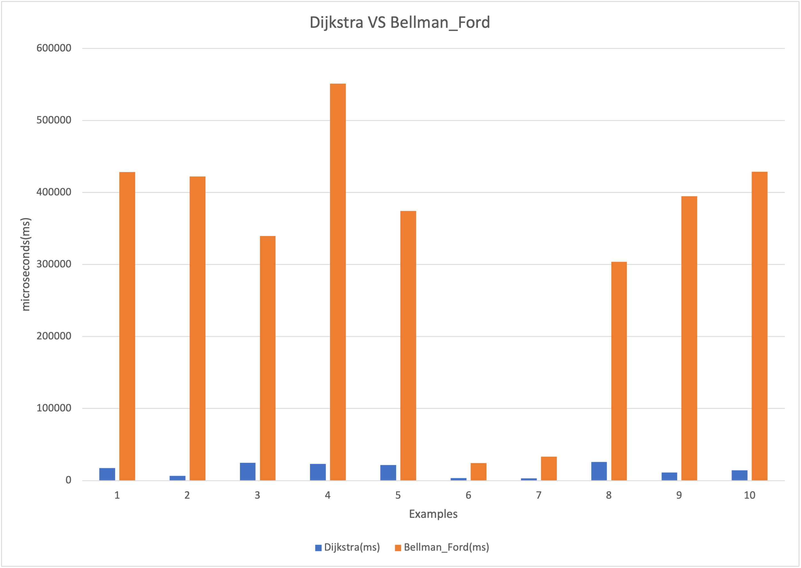
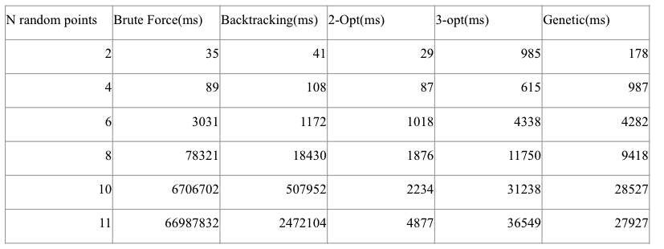
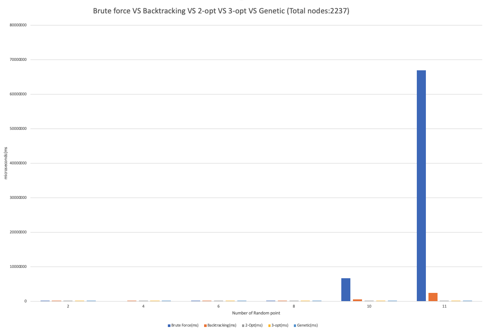

# EE538 Final Project Report - Fall 2021 - TrojanMap

## Group members: Zixin Zhang, Zijian Ye

## Step1: Autocomplete the location name：
For this function, we are going to conside the names of nodes as the locations. In the input, we typed in the name prefix of the location, and the output will give us the partial name of the prefix we typed in. Besides, we need to treat the uppercase and lowercase as the same character.

First, we transform the input name and all the location name of data to lowercase. And we set a flag to 1, if the input name size bigger than the location name of data, we change the flag to 0, if not, we go through the location name of data with size of input name. Then, we push back the result to the vector.

**Time complexity:** O(n*name.size()). n represents the number of nodes in the map. The fist for-loop costs O(n) and the second for-loop costs O(name.size()).

eg: if the input name is 'ch', then the time complexity is O(2n)

**Examples and Time taken by function:**

Input: "ch" \
Output: ["ChickfilA", "Chipotle Mexican Grill"]

Input: "cr" \
Output: ["Crosswalk2", "Crosswalk1","Crosswalk3"]

```shell
**************************************************************
* 1. Autocomplete                                             
**************************************************************

Please input a partial location:ch
*************************Results******************************
ChickfilA
Chipotle Mexican Grill
**************************************************************
Time taken by function: 5594 microseconds

**************************************************************
* 1. Autocomplete                                             
**************************************************************

Please input a partial location:cr
*************************Results******************************
Crosswalk2
Crosswalk1
crosswalk3
**************************************************************
Time taken by function: 5822 microseconds
```

## Step2: Find the place's coordinates in the map:
For this function, the input is the location name. And we want the latitude and longitude of the location name in the output. If the given location does not exist, then return (-1,-1).

First, we find the node of the input location name. Second, we go through the node of data, if the node name is the input location name, then we return the latitude and longitude. If not, we return (-1,-1).

**Time complexity:** O(n*name.size()). n represents the number of nodes in the map. The for-loop costs O(n) and if-statement comparing two strings costs O(name.size()).

**Examples and Time taken by function:**

Input: "ChickfilA" \
Output: (34.0167, -118.283)

Input: "Tap Two Blue" \
Output: (34.0312, -118.274)

Input: "crosswalk3" \
Output: (34.0284, -118.287)

```shell
* 2. Find the position                                        
**************************************************************

Please input a location:ChickfilA
*************************Results******************************
Latitude: 34.0167 Longitude: -118.283
**************************************************************
Time taken by function: 1476 microseconds
```
<p align="center"></p>

```shell
**************************************************************
* 2. Find the position                                        
**************************************************************

Please input a location:Tap Two Blue
*************************Results******************************
Latitude: 34.0312 Longitude: -118.274
**************************************************************
Time taken by function: 1185 microseconds
```
<p align="center"></p>

```shell
**************************************************************
* 2. Find the position                                        
**************************************************************

Please input a location:crosswalk3
*************************Results******************************
Latitude: 34.0284 Longitude: -118.287
**************************************************************
Time taken by function: 4242 microseconds
```
<p align="center"></p>


## Step3: CalculateShortestPath between two places:
### 1. Dijkstra
We use ```priority_queue``` to implement Dijkstra Algorithm. The input is the names of start locaton and end location. We expect the shortest path between these two locations.

- First, we initialize the unordered_map ```distance```, which records the shortest distance value between the location and the start node. The values of ```distance``` are set to INT_MAX and we assign distance value as 0 for the start node, so that it can be picked first.
- Then we use priority_queue ```q```, which is the min-heap, to record the pair of the shortest distance to the start node and the location id.
- While ```q``` is not empty, we implement edge relaxation. We choose a ```min_node``` with the shortest distance to the start node. Iterate through all the neighbors of ```min_node```, for every neighbor, if the new distance value (go through ```min_node```) is less than the original one, then its distance value will be updated. 
- When implementing edge relaxation, we use unordered_map ```pre``` to record the predecessor of the node. If the distance value of min_node's neighbor is updated, then the predecessor of the neighbor is ```min_node```.
- When ```q``` is empty, we can get the shortest distance tree from the start node to the end node with the help of ```pre```.

**Time complexity:** O((m+n)*logn). m represents the number of edges and n represents the number of nodes.

```while (!q.empty())``` runs n times, and ```q.pop``` costs O(logn). The for-loop ```for (auto &i:neigh)``` totally costs O(m)(there are m edges) and ```q.push()``` costs O(logn). Therefore time complexity of the function is O((m+n)*logn).


**Examples and Time taken by function:**
```shell
* 3. CalculateShortestPath                                    
**************************************************************

Please input the start location:Ralphs
Please input the destination:ChickfilA
*************************Results******************************

The distance of the path is:1.53852 miles
**************************************************************
Time taken by function: 21256 microseconds
```
<p align="center"></p>

```shell
* 3. CalculateShortestPath                                    
**************************************************************

Please input the start location:Target
Please input the destination:ChickfilA
*************************Results******************************

The distance of the path is:0.841394 miles
**************************************************************
Time taken by function: 15594 microseconds
```
<p align="center"></p>


### 2. Bellman-Ford
In this section, we implement Bellman-Ford algorithm. 
- First, we initialize a map ```distance``` of size n(n represents the number of nodes) with all distance values from the source to other nodes as infinite(INT_MAX) except the ```dist[start]```, which is 0.
- Then we do edge relaxation for n-1 times, n represents the number of nodes in the map. Because the start node to any other node in the map can have at most n-1 edges. 
- When implementing edge relaxation, we use a map ```pre``` to record the predecessor of the node so that we can get a shortest path tree in the end. And we also set a flag, when there is no change in an edge relaxation, which means the shortest path tree strike a balance, we will break the loop.

**Time complexity:** O(n*m), n represents the number of nodes and m represents the number of edges in the map.

Because we will implement edge relaxations O(n) time and evry edge relaxation costs O(m). Therefor the time complexity if O(n*m).

**Examples and Time taken by function:**

### 3. Runtime compard between Dijkstra and Bellman-Ford
We listed 10 examples to compare the runtime between Dijkstra and Bellman_Ford. 

<p align="center"></p>

<p align="center"></p>

As we can see, the runtime of Dijkstra is less than the Bellman_Ford.


## Step4: The traveling Trojan Problem:
#### 1. Brute force

#### 2. Backtracking
In this section, we implement Backtracking algorithm to solve Traveling Trojan Problem.
**time complexity:** $O(n^2*n!)$


#### 3. 2-opt
**time complexity:** $O(n^3)$


#### 4. Genetic


#### 5. Runtime compard between Brute force, backtracking, 2-opt and Genetic
We listed several examples to compare the runtime between Brute force, backtracking, 2-opt and Genetic.

<p align="center"></p>

<p align="center"></p>

As we can see, the runtime of brute force is much higher than others when the number of nodes get larger.

## Step5: Cycle detection:
For this section, we use a square-shaped subgraph of the original graph by using four corrdinates. And it follows the order of left, right, upper and lower bounds. We are tring to determine if there is a cycle path in that subgraph.

First, we can get the left, right, upper and lower bounds from the ```std::vector<double> square```. Second, we go through the data's latitude and longtitude to see any points are in the square and we push back to vector which named points. We are using DFS for the cycle detection, we need to consider the parent in the cycle detection incase there are two nodes that is detected as a cycle. Then, we use a map with booling named visited, we set every point in points are false. And go through all the points using recursive DFS. Eventually, we plot the path and square out.

Time complexity: 

Time spent: 

Example 1:
```shell
Input: square = {-118.278,-118.267,34.028,34.015}
Output: true
```

```shell
**************************************************************
* 5. Cycle Detection                                          
**************************************************************

Please input the left bound longitude(between -118.299 and -118.264):-118.278
Please input the right bound longitude(between -118.299 and -118.264):-118.267
Please input the upper bound latitude(between 34.011 and 34.032):34.028
Please input the lower bound latitude(between 34.011 and 34.032):34.015
*************************Results******************************
there exists cycle in the subgraph 
**************************************************************
Time taken by function: 206059 microseconds
```

<p align="center"></p>

Example 2:
```shell
Input: square = {-118.294, -118.265, 34.031, 34.012}
Output: true
```

```shell
**************************************************************
* 5. Cycle Detection                                          
**************************************************************

Please input the left bound longitude(between -118.299 and -118.264):-118.294
Please input the right bound longitude(between -118.299 and -118.264):-118.265
Please input the upper bound latitude(between 34.011 and 34.032):34.031
Please input the lower bound latitude(between 34.011 and 34.032):34.012
*************************Results******************************
there exists cycle in the subgraph 
**************************************************************
Time taken by function: 264530 microseconds
```

<p align="center"></p>

## Step6: Topological Sort:
In this section, we are going to find the feasible route according to some dependencies. We mainly use DFS to realize Topological Sort.

- First, we initialize the edge map which contains the node and its neighbors and the mark map which is used to record whether the node has been marked.
- Then we use DFS and mark map to recursivly access every node in ```locations```. Through using DFS, we will get the deepest node first. Therefore, to get the final result, we need to reverse the original result obtained by DFS.

**Time complexity** If m>=n, it's O(m); if n>m, it O(n). m represents the number of edges(the length of ```dependencies```). n represents the number of nodes in ```locations```
Obtaining the edge map costs O(m). The time complexity of DFS is O(n).

**Examples and Time taken by function:**


## Step7: Find K closest points:
For this section, we are going to find the k closest location with the name on the map and return a vector of string ids.

We are using heap for this section. First, we create a priority queue and set the return vector to be the k sizes. Then, we get the location name and the location's latitude and longitude. After that, we calculate the distance and put that in the queue. If the size of queue is equal to k size, then we compare the distance we calculated with the distance in the queue. If the distance we calculated is smaller than the distance in the queue. We replace it with the smallest one.

Time complexity: 

Time spent: 

```shell
**************************************************************
* 7. Find K Closest Points                                    
**************************************************************

Please input the locations:Ralphs
Please input k:5
358794109: 0.121023
358828789: 0.105633
7158047272: 0.0997647
358791507: 0.0848742
3724125231: 0.0584317
*************************Results******************************
Find K Closest Points Results:
1 St Agnes Church
2 Saint Agnes Elementary School
3 Warning Skate Shop
4 Menlo AvenueWest Twentyninth Street Historic District
5 Vermont Elementary School
**************************************************************
Time taken by function: 6171 microseconds
```

```shell
**************************************************************
* 7. Find K Closest Points                                    
**************************************************************

Please input the locations:Moreton Fig
Please input k:7
2817034895: 0.0789534
2817034894: 0.0732835
4399693645: 0.0651576
2305853438: 0.0630711
2305853437: 0.0540357
5229911604: 0.0426097
5229911615: 0.0305817
*************************Results******************************
Find K Closest Points Results:
1 Student Union STU
2 Tutor Campus Center Piano
3 Traveler39s Fountain
4 Tommy Trojan
5 George Tirebiter
6 Allan Hancock Foundation
7 Newman Recital Hall in Hancock Foundation
**************************************************************
Time taken by function: 4952 microseconds
```