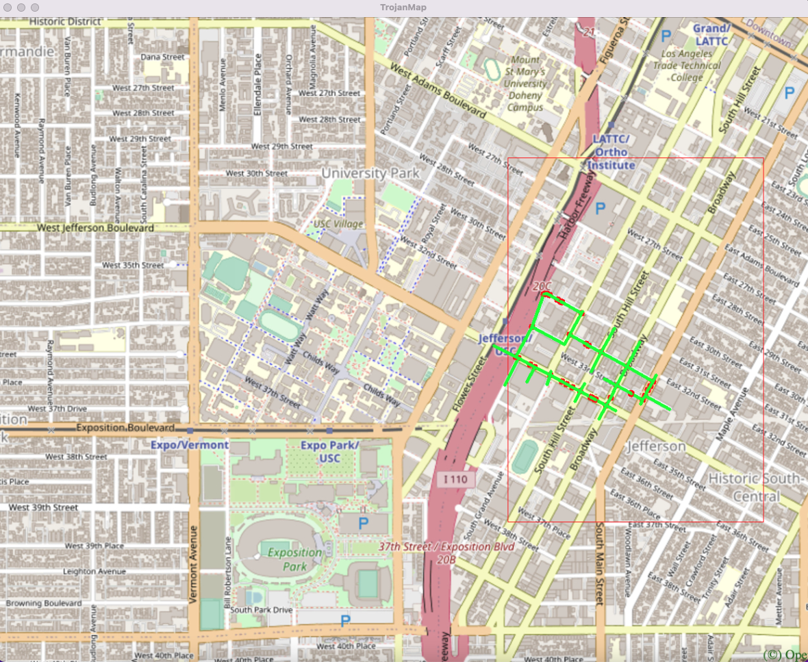

# EE538 Final Project Report - Fall 2021 - TrojanMap

## Group members: Zixin Zhang, Zijian Ye

## Step1: Autocomplete the location name：
For this function, we are going to conside the names of nodes as the locations. In the input, we typed in the name prefix of the location, and the output will give us the partial name of the prefix we typed in. Besides, we need to treat the uppercase and lowercase as the same character.

First, we transform the input name and all the location name of data to lowercase. And we set a flag to 1, if the input name size bigger than the location name of data, we change the flag to 0, if not, we go through the location name of data with size of input name. Then, we push back the result to the vector.

Time complexity: O(n*input.size()).

eg: if the input is 'ch', then the time complexity is O(2n)

Time spent: 
Example:

Input: "ch" \
Output: ["ChickfilA", "Chipotle Mexican Grill"]

Input: "cr" \
Output: ["Crosswalk2", "Crosswalk1","Crosswalk3"]

```shell
**************************************************************
* 1. Autocomplete                                             
**************************************************************

Please input a partial location:ch
*************************Results******************************
ChickfilA
Chipotle Mexican Grill
**************************************************************
Time taken by function: 5594 microseconds

**************************************************************
* 1. Autocomplete                                             
**************************************************************

Please input a partial location:cr
*************************Results******************************
Crosswalk2
Crosswalk1
crosswalk3
**************************************************************
Time taken by function: 5822 microseconds
```

## Step2: Find the place's coordinates in the map:
For this function, the input is the location name. And we want the latitude and longitude of the location name in the output. If the given location does not exist, then return (-1,-1).

First, we find the node of the input location name. Second, we go through the node of data, if the node name is the input location name, then we return the latitude and longitude. If not, we return (-1,-1).

Time complexity: O(n).

Time spent: 

Example:

Input: "ChickfilA" \
Output: (34.0167, -118.283)

Input: "Tap Two Blue" \
Output: (34.0312, -118.274)

Input: "crosswalk3" \
Output: (34.0284, -118.287)

```shell
* 2. Find the position                                        
**************************************************************

Please input a location:ChickfilA
*************************Results******************************
Latitude: 34.0167 Longitude: -118.283
**************************************************************
Time taken by function: 1476 microseconds

**************************************************************
* 2. Find the position                                        
**************************************************************

Please input a location:Tap Two Blue
*************************Results******************************
Latitude: 34.0312 Longitude: -118.274
**************************************************************
Time taken by function: 1185 microseconds

**************************************************************
* 2. Find the position                                        
**************************************************************

Please input a location:crosswalk3
*************************Results******************************
Latitude: 34.0284 Longitude: -118.287
**************************************************************
Time taken by function: 4242 microseconds
```

## Step3: CalculateShortestPath_Dijkstra:
## Step4: The traveling Trojan Problem:
## Step5: Cycle detection:
For this section, we use a square-shaped subgraph of the original graph by using four corrdinates. And it follows the order of left, right, upper and lower bounds. We are tring to determine if there is a circle path in that subgraph.

First, we can get the left, right, upper and lower bounds from the ```std::vector<double> square```. Second, we go through the data's latitude and longtitude to see any points are in the square and we push back to vector which named points. We are using DFS for the circle detection, we need to consider the parent in the circle detection incase there are two nodes that is detected as a circle. Then, we use a map with booling named visited, we set every point in points are false. And go through all the points using recursive DFS. Eventually, we plot the path and square out.

Time complexity: 

Time spent: 

Example 1:
```shell
Input: square = {-118.278,-118.267,34.028,34.015}
Output: true
```
<p align="center"></p>
## Step6: Topological Sort:
## Step7: Find K closest points: